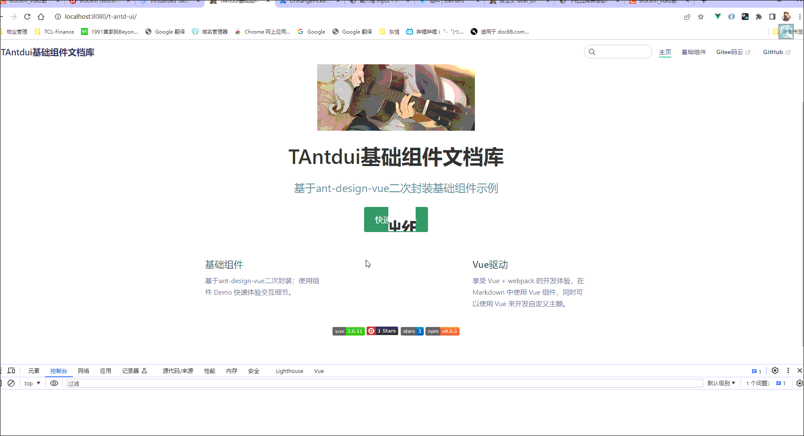

# T-antd-ui

## [Vue3 基础组件传送门](https://github.com/wocwin/t-ui-plus)

> 基于 Element-plus 二次封装基础组件地址

## [Vue2 基于Element-ui封装基础组件码云地址](https://gitee.com/wocwin/t-ui)
## [Vue2 基于Element-ui封装基础组件GitHub地址](https://github.com/wocwin/t-ui)

> 基于 Element-ui 二次封装基础组件地址

## 介绍

> 基于 ant-design-vue 二次封装组件

这是我在学习 Vue 中[ant-design-vue](https://www.antdv.com/docs/vue/introduce-cn/)二次封装基础组件文档，希望对你有用。可查看 [详细组件案例文档](https://wocwin.github.io/t-antd-ui/) 预览

<!-- <p align="center">
  <a href="https://github.com/vuejs/vue" target="_blank">
    
  </a>
  <a href="https://gitee.com/wocwin/t-antd-ui/stargazers">
    
  </a>
  <a href="https://github.com/wocwin/t-antd-ui/stargazers" target="_blank">
    
  </a>
   <a href="https://www.npmjs.com/package/@wocwin/t-antd-ui" target="_blank">
      
    </a>
</p> -->

## 动态效果图



## npm 方式安装使用

> ### 前提条件是：全局注册ant-design-vue组件库

```js
// 先安装
npm i @wocwin/t-antd-ui
// 1、 在main.js中按下引入(全局使用)
import TAntdui from '@wocwin/t-antd-ui'
Vue.use(TAntdui)

// 2、按需引入，在单个vue文件如下引入，在注册；或者在main.js中如下引入在注册，皆可！
import { TAntdLayoutTable, TAntdLayoutForm, TAntdLayoutConditional } from '@wocwin/t-ui'

```

## 直接在项目中全局使用

```js
// 1、把packages文件夹复制，放在自己项目中
// 2、假设 packages 与 src是同级，那么src下 main.js 如下操作即可全局使用t-ui
import TAntdui from '../packages'
Vue.use(TAntdui)
```

## 安装依赖

```shell
npm install

```

## 本地运行 src 中组件示例

```shell
npm run serve
```

## 本地运行 vuepress 中组件文档

```shell
npm run docs:dev

```

## 微信交流群

|                微信二维码                 |
| :---------------------------------------: |
|  |
